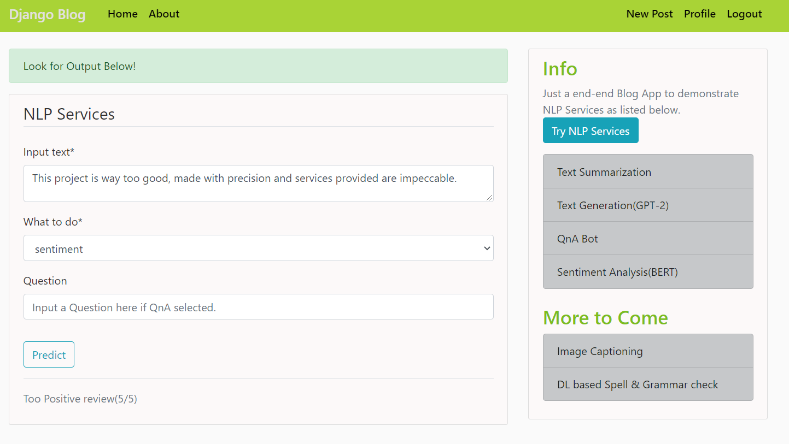

# NLP-Django-Blog-App
Just a fully functional end-end Blog App built in Django with functional NLP Services(Text Summarization, Text Generation, QnA Bot, Sentiment analysis)

### For demo Video: 

# How to Run
#### 1. Create Virtual Environment.(Python==3.8)
#### 2. Install requirements(pip install -r requirements.txt)
#### 3. cd django_project folder and run "python manage.py runserver"

# Soon to be added:
#### 1. Custom trained Image captioning model.
#### 2. Text to speech and speech to text.
#### 3. DL based spell and grammar check.
